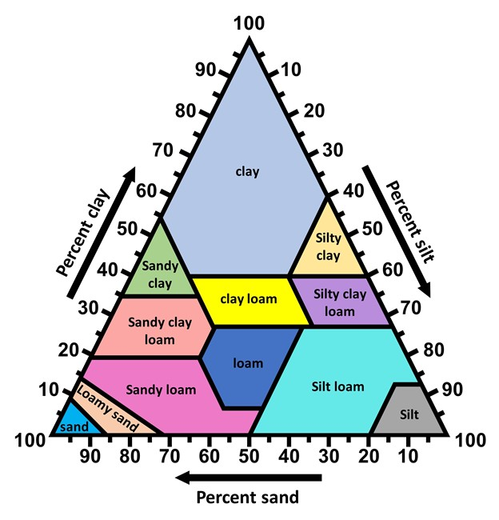

        

             <h1> راهنمای تعیین بافت خاک برای مدیریت هوشمند آبیاری 🌱</h1>
        

        

            <!-- بخش 1: تعریف بافت خاک -->
            

                

                    🔬 تعریف بافت خاک و انواع ذرات
                    −
                

                

                    

                        

                            بافت خاک به درصد نسبی ذرات معدنی شن، سیلت و رس در خاک اطلاق می‌شود. این ویژگی فیزیکی اساسی خاک، تعیین‌کننده بسیاری از خصوصیات هیدرولوژیکی و زراعی خاک از جمله ظرفیت نگهداری آب، سرعت نفوذ آب، تهویه و قابلیت دسترسی ریشه‌ها به آب و مواد غذایی است.
                        

                        

                            

                                <h3>🏖️ ذرات شن (Sand)</h3>
                                                          
<strong>اندازه:</strong> 2 میلی‌متر تا 50 میکرومتر

                            
درشت‌ترین ذرات هستند. نفوذپذیری آب بالا و ظرفیت نگهداری آب و مواد غذایی پایینی دارند. به خاک‌های شنی، خاک سبک می‌گویند.

                            

                            

                                <h3>🌾 ذرات سیلت (Silt)</h3>
                                                            
<strong>اندازه:</strong> 50 تا 2 میکرومتر

                            
اندازه‌ای بین شن و رس دارند. ظرفیت نگهداری آب متوسطی دارند و زهکشی آن‌ها نیز متوسط است.

                            

                            

                                <h3>🧱 ذرات رس (Clay)</h3>
                                                           
<strong>اندازه:</strong> کوچکتر از 2 میکرومتر

                            
ریزترین ذرات هستند. نفوذپذیری آب بسیار پایین و ظرفیت نگهداری آب و مواد غذایی بالایی دارند. به خاک‌های رسی، خاک سنگین می‌گویند.

                            

                    

                        

                         

                        <strong>🌿 لوم (Loam):</strong> به خاکی گفته می‌شود که ترکیبی تقریباً متعادل از این سه ذره را داشته باشد و به طور عمومی بهترین بافت برای رشد گیاه به حساب می‌آید.
                    

                    

                

            

            

            <!-- بخش 2: اهمیت تشخیص بافت -->
            

                

                    ⚡ اهمیت تشخیص بافت خاک در مدیریت هوشمند آبیاری
                    −
                

                

                    

                        

                            شناخت دقیق بافت خاک، پایه و اساس برنامه‌ریزی دقیق آبیاری و بهینه‌سازی مصرف آب در کشاورزی است. در ادامه، سه دلیل کلیدی اهمیت این شناخت آورده شده است:
                        

                        <ol class="importance-list">
                            <li>
                                <strong>💧 ظرفیت نگهداری آب:</strong> بافت خاک مستقیماً تعیین می‌کند که خاک چقدر آب می‌تواند برای گیاه نگه دارد (ظرفیت زراعی). خاک‌های رسی آب بیشتری ذخیره می‌کنند، در حالی که خاک‌های شنی به سرعت آب را از دست می‌دهند.
                            </li>
                            <li>
                                <strong>🚿 سرعت نفوذ و زهکشی آب:</strong> خاک‌های شنی آب را سریع جذب کرده و به سرعت زهکشی می‌کنند (نفوذپذیری بالا)، لذا نیاز به آبیاری‌های <strong>کوتاه‌تر و مکررتر</strong> دارند. در مقابل، خاک‌های رسی آهسته‌تر آب را جذب کرده و نگه می‌دارند (نفوذپذیری پایین)، که خطر رواناب و غرقابی شدن در آن‌ها بیشتر است و نیاز به آبیاری‌های <strong>طولانی‌تر با فواصل بیشتر</strong> دارند.
                            </li>
                            <li>
                                <strong>📊 انتخاب سنسور و روش آبیاری:</strong> بافت خاک بر انتخاب نوع و محل قرارگیری سنسورهای رطوبت خاک و همچنین بر سیستم آبیاری مناسب (مثلاً آبیاری قطره‌ای برای خاک‌های رسی بهتر است) تأثیر می‌گذارد.
                            </li>
                        </ol>
                    

                

            

            

            <!-- بخش 3: راهنمای مزرعه‌ای (شامل زیربخش‌ها) -->
            

                

                    🔍 راهنمای مزرعه‌ای تشخیص بافت خاک با چشم و دست
                    −
                

                

                    

                        

                            در غیاب نتایج آزمایشگاهی، می‌توانید با استفاده از این روش‌های ساده و با تکیه بر حس لامسه و مشاهدات چشمی خود، پازل بافت خاک مزرعه را به صورت تجربی و سریع حل کنید و مدیریت آبیاری را آغاز نمایید.
                        

                        <!-- زیربخش 1: روش آزمون لوله -->
                        

                            

                                🧪 روش آزمون لوله (Jar Test - چشمی)
                                −
                            

                            

                                

                                    

                                        <h4>📋 مراحل انجام:</h4>
                                        

                                            

                                                <strong>مرحله 1:</strong> مقداری خاک (حدود یک چهارم ظرف) را در یک شیشه دربسته (مانند شیشه مربا) بریزید.
                                            

                                            

                                                <strong>مرحله 2:</strong> آب و یک قاشق چایخوری مایع ظرفشویی (به عنوان عامل پراکنده‌ساز) به آن اضافه کنید تا ظرف تقریباً پر شود.
                                            

                                            

                                                <strong>مرحله 3:</strong> ظرف را به شدت برای چند دقیقه تکان دهید تا ذرات خاک کاملاً پراکنده شوند.
                                            

                                            

                                                <strong>مرحله 4:</strong> اجازه دهید خاک ته‌نشین شود و تغییرات را مشاهده کنید:
                                                <ul style="margin-top: 10px;">
                                                    <li><strong>⏱️ پس از 1 دقیقه:</strong> ذرات درشت <strong>شن</strong> ته‌نشین می‌شوند.</li>
                                                    <li><strong>⏰ پس از 2 ساعت:</strong> ذرات <strong>سیلت</strong> روی شن‌ها ته‌نشین می‌شوند.</li>
                                                    <li><strong>🕐 پس از 24 تا 48 ساعت:</strong> ذرات بسیار ریز <strong>رس</strong> در نهایت روی سیلت‌ها ته‌نشین شده و یا معلق می‌مانند (بخش رس).</li>
                                                </ul>
                                            

                                        

                                    

                                    <h4 style="margin: 20px 0 12px 0; color: #2c3e50;">📐 تشخیص و محاسبه:</h4>
                                    

                                        پس از ته‌نشین شدن کامل ذرات در روش آزمون لوله، شما می‌توانید با اندازه‌گیری ارتفاع هر لایه، درصد تقریبی شن، سیلت و رس را از طریق رابطه زیر محاسبه کنید:
                                    

                                    

                                        📊 درصد هر جزء $=$ (ارتفاع لایه هر جزء (میلیمتر) $\div$ ارتفاع کل رسوبات ته‌نشین شده (میلی متر)) $\times$ $100$
                                    

                                    <h4 style="margin: 20px 0 12px 0; color: #2c3e50;">📈 تفسیر نتایج:</h4>
                                    

                                        برای تعیین دقیق نام بافت خاک (مانند لوم شنی، لوم رسی و...)، باید از <strong>🔺 مثلث بافت خاک</strong> استفاده کنید. این مثلث یک نمودار سه‌گانه است که ارتباط بین درصدهای شن، سیلت و رس را نمایش می‌دهد و خاک را به ۱۲ گروه بافتی طبقه‌بندی می‌کند.
                                    

                                

                            

                        

                        <!-- زیربخش 2: مثلث بافت خاک -->
                        

                            

                                🔺 نحوه استفاده از مثلث بافت خاک
                                −
                            

                            

                                

                                    

                                        <ol style="padding-right: 25px;">
                                            <li style="margin: 12px 0; line-height: 1.7;"><strong>🏖️ محور شن (Sand):</strong> درصد شن را در ضلع پایینی مثلث پیدا کنید. خطوط شن <strong>به سمت چپ</strong> و موازی با ضلع سیلت حرکت می‌کنند.</li>
                                            <li style="margin: 12px 0; line-height: 1.7;"><strong>🧱 محور رس (Clay):</strong> درصد رس را در ضلع چپ مثلث پیدا کنید. خطوط رس <strong>به سمت راست</strong> و موازی با ضلع شن حرکت می‌کنند.</li>
                                            <li style="margin: 12px 0; line-height: 1.7;"><strong>🌾 محور سیلت (Silt):</strong> درصد سیلت را در ضلع راست مثلث پیدا کنید. خطوط سیلت <strong>به صورت افقی</strong> (یا موازی با ضلع رس) حرکت می‌کنند.</li>
                                        </ol>
                                    

                                    

                                        نقطه‌ای که سه خط (که از درصدهای به دست آمده شن، سیلت و رس رسم شده‌اند) یکدیگر را قطع می‌کنند، نشان‌دهنده کلاس بافتی خاک شماست.
                                    

                                    

                                        <strong>💡 نکته مهم:</strong> دقت کنید که مجموع درصدهای شن، سیلت و رس همیشه باید <strong>100%</strong> باشد.
                                    

                                    

                                        
                                        
🔺 مثلث بافت خاک USDA - راهنمای تعیین کلاس بافتی

                                    

                                

                            

                        

                        <!-- زیربخش 3: روش آزمون مفتول -->
                        

                            

                                🤏 روش آزمون مفتول (Ribbon Test - لمسی)
                                −
                            

                            

                                

                                    

                                        این روش به شما کمک می‌کند تا میزان <strong>چسبندگی و خمیری بودن</strong> خاک را (که مستقیماً با میزان رس مرتبط است) تعیین کنید.
                                    

                                    

                                        <table>
                                            <thead>
                                                <tr>
                                                    <th>نوع بافت خاک</th>
                                                    <th>خصوصیت هنگام لمس</th>
                                                    <th>آزمون مفتول</th>
                                                </tr>
                                            </thead>
                                            <tbody>
                                                <tr>
                                                    <td><strong>🏖️ شنی</strong> Sand</td>
                                                    <td>زبر، دانه‌دانه</td>
                                                    <td>مفتول نمی‌شود یا به صورت نوار خیلی کوتاه و شکننده کمتر از 2.5 سانتی‌متر تشکیل می‌دهد.</td>
                                                </tr>
                                                <tr>
                                                    <td><strong>🌱 لومی شنی</strong> Loamy Sand</td>
                                                    <td>کمی زبر، حس نرمی کم</td>
                                                    <td>به سختی مفتول می‌شود، نوار بسیار شکننده در حد 2.5 تا 3 سانتی‌متر.</td>
                                                </tr>
                                                <tr>
                                                    <td><strong>🌿 لوم</strong> Loam</td>
                                                    <td>حس مخملین و نرمی دارد، کمی زبر</td>
                                                    <td>نوار کوتاهی (حدود 2.5 تا 5 سانتی‌متر) تشکیل می‌دهد که به راحتی می‌شکند و حس پلاستیکی کمی دارد.</td>
                                                </tr>
                                                <tr>
                                                    <td><strong>🏺 لوم رسی</strong> Clay Loam</td>
                                                    <td>حس چسبندگی و خمیری بودن دارد، تا حدی زبر (به دلیل شن)</td>
                                                    <td>نوار نسبتاً بلند و قابل انعطاف (حدود 5 تا 7.5 سانتی‌متر) تشکیل می‌دهد.</td>
                                                </tr>
                                                <tr>
                                                    <td><strong>🧱 رسی</strong> Clay</td>
                                                    <td>بسیار چسبنده، خمیری و لیز هنگام مرطوب بودن</td>
                                                    <td>به راحتی یک نوار بلند و پایدار (بیشتر از 7.5 سانتی‌متر) تشکیل می‌دهد که قابل خم شدن است.</td>
                                                </tr>
                                            </tbody>
                                        </table>
                                    

                                    

                                        <strong>⚠️ نکته مهم:</strong> برای انجام این آزمایش، مقدار کمی از خاک را بردارید، به آرامی آب اضافه کنید و آن را بین شست و انگشت اشاره بمالید تا به حالت خمیری درآید. سپس سعی کنید با فشار دادن، یک نوار یا مفتول به قطر حدود 3 میلی‌متر ایجاد کنید.
                                    

                                

                            

                        

                    

                

            

            

            <!-- بخش 4: جدول پارامترهای رطوبتی -->
            

                

                    📊 جدول راهنمای پارامترهای رطوبتی خاک برای آبیاری
                    −
                

                

                    

                        

                            هم اکنون که بافت خاک خود را مشخص کرده‌اید، مقادیر پارامترهای مربوط به آن را از جدول زیر استخراج کنید و در بخش "<strong>📝 لیست خاک‌ها</strong>" وارد نمایید.
                        

                        

                            <table>
                                <thead>
                                    <tr>
                                        <th>بافت خاک</th>
                                        <th>سرعت نفوذ نهایی خاک f0 (mm/hr)</th>
                                        <th>تخلخل n (%)</th>
                                        <th>رطوبت حد زراعی FC (%)</th>
                                        <th>رطوبت حد پژمردگی PWP (%)</th>
                                        <th>آب قابل دسترس TAW (mm/m)</th>
                                    </tr>
                                </thead>
                                <tbody>
                                    <tr>
                                        <td><strong>شنی</strong> Sandy</td>
                                        <td>20 - 30</td>
                                        <td>38 - 43</td>
                                        <td>7 - 14</td>
                                        <td>2 - 6</td>
                                        <td>50 - 75</td>
                                    </tr>
                                    <tr>
                                        <td><strong>لوم شنی</strong> Sandy Loam</td>
                                        <td>10 - 20</td>
                                        <td>38 - 46</td>
                                        <td>11 - 19</td>
                                        <td>4 - 8</td>
                                        <td>75 - 115</td>
                                    </tr>
                                    <tr>
                                        <td><strong>لوم</strong> Loam</td>
                                        <td>8 - 20</td>
                                        <td>43 - 49</td>
                                        <td>18 - 26</td>
                                        <td>8 - 12</td>
                                        <td>100 - 140</td>
                                    </tr>
                                    <tr>
                                        <td><strong>لوم رسی</strong> Clay Loam</td>
                                        <td>2 - 10</td>
                                        <td>40 - 49</td>
                                        <td>23 - 31</td>
                                        <td>11 - 15</td>
                                        <td>120 - 160</td>
                                    </tr>
                                    <tr>
                                        <td><strong>سیلتی لوم</strong> Silty Loam</td>
                                        <td>5 - 13</td>
                                        <td>46 - 54</td>
                                        <td>20 - 30</td>
                                        <td>9 - 14</td>
                                        <td>110 - 160</td>
                                    </tr>
                                    <tr>
                                        <td><strong>رسی</strong> Clay</td>
                                        <td>1 - 5</td>
                                        <td>43 - 58</td>
                                        <td>31 - 39</td>
                                        <td>15 - 19</td>
                                        <td>160 - 200</td>
                                    </tr>
                                </tbody>
                            </table>
                        

                        

                            <strong>✅ نتیجه‌گیری:</strong> با شناخت دقیق بافت خاک و استفاده از پارامترهای مناسب، می‌توانید به مدیریت بهینه آبیاری دست یابید و بهره‌وری مصرف آب را به حداکثر برسانید.
                        

                    

                

            

        

    

   